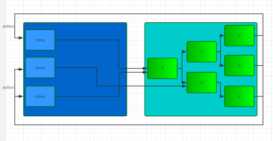
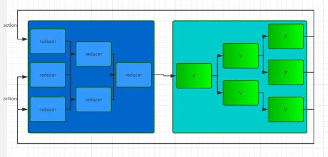

# React.js
### why React？
React是Facebook开发的一款JS库，那么Facebook为什么要建造React呢，主要为了解决什么问题，通过这个又是如何解决的？

Facebook认为MVC无法满足他们的扩展需求，由于他们非常巨大的代码库和庞大的组织，使得MVC很快变得非常复复杂，每当需要添加一项新的功能或特性时，系统的复杂度就成级数增长，致使代码变得脆弱和不可预测，结果导致他们的MVC正在土崩瓦解。认为MVC不适合大规模应用，当系统中有很多的模型和相应的视图时，其复杂度就会迅速扩大，非常难以理解和调试，特别是模型和视图间可能存在的双向数据流动。

解决这个问题需要“以某种方式组织代码，使其更加可预测”，由此,他们推出了React。

### React

构建那些数据会随时间改变的大型应用，做这些，React有两个主要的特点：

- 简单
简单的表述任意时间点你的应用应该是什么样子的，React将会自动的管理UI界面更新当数据发生变化的时候。

- 声明式
在数据发生变化的时候，React从概念上讲与点击了F5一样，实际上它仅仅是更新了变化的一部分而已。
React是关于构造可重用组件的，实际上，使用React你做的仅仅是构建组建。通过封装，使得组件代码复用、测试以及关注点分离更加容易。

另外在React官网上，通过《Why did we build React?》[为什么我们要建造React](https://github.com/yxl2628/reactjs/blob/master/Why_did_we_build_React.md)的文档中还可以了解到以下四点：
- React不是一个MVC框架
- React不使用模板
- 响应式更新非常简单
- HTML5仅仅是个开始

#### React主要的原理
##### Virtual DOM 虚拟DOM
传统的web应用，操作DOM一般是直接更新操作的，但是我们知道DOM更新通常是比较昂贵的。而React为了尽可能减少对DOM的操作，提供了一种不同的而又强大的方式来更新DOM，代替直接的DOM操作。就是Virtual DOM,一个轻量级的虚拟的DOM，就是React抽象出来的一个对象，描述dom应该什么样子的，应该如何呈现。通过这个Virtual DOM去更新真实的DOM，由这个Virtual DOM管理真实DOM的更新。

为什么通过这多一层的Virtual DOM操作就能更快呢？ 这是因为React有个diff算法，更新Virtual DOM并不保证马上影响真实的DOM，React会等到事件循环结束，然后利用这个diff算法，通过当前新的dom表述与之前的作比较，计算出最小的步骤更新真实的DOM。

##### Components 组件

在DOM树上的节点被称为元素，在这里则不同，Virtual DOM上称为commponent。Virtual DOM的节点就是一个完整抽象的组件，它是由commponents组成。

> component 的使用在 React 里极为重要, 因为 components 的存在让计算 DOM diff 更高效。

##### State 和 Render
React是如何呈现真实的DOM，如何渲染组件，什么时候渲染，怎么同步更新的，这就需要简单了解下State和Render了。state属性包含定义组件所需要的一些数据，当数据发生变化时，将会调用Render重现渲染，这里只能通过提供的setState方法更新数据。

### Flux

Flux 是一种应用架构，或者说是一种思想，它跟 React 本身没什么关系，它可以用在 React 上，也可以用在别的框架上。前面说到 Flux 在 React 中主要用来统一管理引起 state 变化的情况。Flux 维护着一个或者多个叫做 Store 的变量，就像 MVC 里面的 Model，里面存放着应用用到的所有数据，当一个事件触发时 ，Flux 对事件进行处理，对 Store 进行更新，当 Store 发生变化时，通常是由应用的根组件（也叫 controller view）去获取最新的 store，然后更新 state，之后利用 React 单向数据流的特点一层层将新的 state 向下传递实现 view 的更新。这里的 controller view 可以有多个也可以不是根组件，但是这样数据流维护起来就比较麻烦。

Flux 的思维模型如下：

Flux 主要包括四个部分， Dispatcher 、 Store 、 View 、 Action ，其中 Dispatcher 是 Flux 的核心枢纽，它相当于是一个事件分发器，将那些分散在各个组件里面的逻辑代码收集起来，统一在 Dispatcher 中进行处理。完整的 Flux 处理流程是这样的：用户通过与 view 交互或者外部产生一个 Action，Dispatcher 接收到 Action 并执行那些已经注册的回调，向所有 Store 分发 Action。通过注册的回调，Store 响应那些与他们所保存的状态有关的 Action。然后 Store 会触发一个 change 事件，来提醒 controller-views 数据已经发生了改变。Controller-views 监听这些事件并重新从 Store 中获取数据。这些 controller-views 调用他们自己的 setState() 方法，重新渲染自身以及组件树上的所有后代组件。使用 Flux 有个好处就是我只需要用 action 对象向 Dispatcher 描述当前的事件就可以执行对应的逻辑，因为 Dispatcher 是所有 Action 的处理中心，即使没有对应的事件发生，我们也可以“伪造”一个出来，非常利于测试。

### Redux

Redux 的作用跟 Flux 是一样的，它可以看作是 Flux 的一种实现，但是又有点不同，具体的不同总结起来就是：

1. Redux 只有一个 store Flux 里面会有多个 store 存储应用数据，并在 store 里面执行更新逻辑，当 store 变化的时候再通知 controller-view 更新自己的数据，Redux 将各个 store 整合成一个完整的 store，并且可以根据这个 store 推导出应用完整的 state。同时 Redux 中更新的逻辑也不在 store 中执行而是放在 reducer 中。
2. 没有 Dispatcher Redux 中没有 Dispatcher 的概念，它使用 reducer 来进行事件的处理，reducer 是一个纯函数，这个函数被表述为 (previousState, action) => newState ，它根据应用的状态和当前的 action 推导出新的 state。Redux 中有多个 reducer，每个 reducer 负责维护应用整体 state 树中的某一部分，多个 reducer 可以通过 combineReducers 方法合成一个根reducer，这个根reducer负责维护完整的 state，当一个 action 被发出，store 会调用 dispatch 方法向某个特定的 reducer 传递该 action，reducer 收到 action 之后执行对应的更新逻辑然后返回一个新的 state，state 的更新最终会传递到根reducer处，返回一个全新的完整的 state，然后传递给 view。

Redux 和 Flux 之间最大的区别就是对 store/reducer 的抽象，Flux 中 store 是各自为战的，每个 store 只对对应的 controller-view 负责，每次更新都只通知对应的 controller-view；而 Redux 中各子 reducer 都是由根reducer统一管理的，每个子reducer的变化都要经过根reducer的整合。用图表示的话可以像这样：

Flux 中的 store 是这样的：

Redux 中的 store（或者叫 reducer）是这样的：

