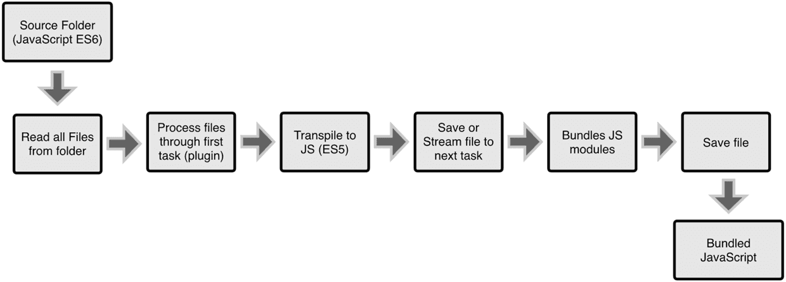

# 前置知识
### html5   
HTML5 是 W3C 与 WHATWG 合作的结果,WHATWG 指 Web Hypertext Application Technology Working Group。

WHATWG 致力于 web 表单和应用程序，而 W3C 专注于 XHTML 2.0。在 2006 年，双方决定进行合作，来创建一个新版本的 HTML。

html5的一些新特性:
1. 用于绘画的 canvas 元素
2. 用于媒介回放的 video 和 audio 元素
3. 对本地离线存储的更好的支持(localStorage、sessionStorage)
4. 新的特殊内容元素，比如 article、footer、header、nav、section
5. 新的表单控件，比如 calendar、date、time、email、url、search

### css3   
CSS即层叠样式表（Cascading StyleSheet）。 在网页制作时采用层叠样式表技术，可以有效地对页面的布局、字体、颜色、背景和其它效果实现更加精确的控制。 只要对相应的代码做一些简单的修改，就可以改变同一页面的不同部分，或者页数不同的网页的外观和格式。CSS3是CSS技术的升级版本，CSS3语言开发是朝着模块化发展的。以前的规范作为一个模块实在是太庞大而且比较复杂，所以，把它分解为一些小的模块，更多新的模块也被加入进来。

CSS3 模块包括：
1. 选择器
2. 框模型
3. 背景和边框
4. 文本效果
5. 2D/3D 转换
6. 动画
7. 多列布局
8. 用户界面

### ES6
ECMAScript 6.0（以下简称 ES6）是 JavaScript 语言的下一代标准，已经在2015年6月正式发布了。它的目标，是使得 JavaScript 语言可以用来编写复杂的大型应用程序，成为企业级开发语言。

ES6 新特性包括(React可能会用到的部分):
1. 变量声明
  - const 和 let
  > const 和 let，分别表示常量和变量。不同于 var 的函数作用域，const 和 let 都是块级作用域。

  - 模板字符串
  > 模板字符串提供了另一种做字符串组合的方法。

  - 默认参数
  > function中允许增加默认参数了

2. 箭头函数
> 函数的快捷写法，不需要通过 function 关键字创建函数，并且还可以省略 return 关键字。同时，箭头函数还会继承当前上下文的 this 关键字。

3. 模块的 Import 和 Export
> import 用于引入模块，export 用于导出模块。

4. ES6 对象和数组
  - 析构赋值
  > 析构赋值让我们从 Object 或 Array 里取部分数据存为变量。

  - 对象字面量改进
  > 这是析构的反向操作，用于重新组织一个 Object 。

  - Spread Operator
  > Spread Operator 即 3 个点 ...，可用于组装数组、也可用于获取数组的部分项、还可收集函数参数为数组、代替 apply。

5. Promises
> Promise 用于更优雅地处理异步请求。

6. Generators
> Generator 返回的是迭代器，通过 yield 关键字实现暂停功能。

### 代码处理
### Node.js
简单的说 Node.js 就是运行在服务端的 JavaScript。Node.js 是一个基于Chrome JavaScript 运行时建立的一个平台。Node.js是一个事件驱动I/O服务端JavaScript环境，基于Google的V8引擎，V8引擎执行Javascript的速度非常快，性能非常好。

NPM是随同NodeJS一起安装的包管理工具，能解决NodeJS代码部署上的很多问题。

我们的开发环境都是基于Node.js来搭建的,包括下面要讲到的Babel CssMoules Webpack等,都需要依赖node.js环境

### Babel   
Babel是一个广泛使用的转码器，可以将ES6代码转为ES5代码，从而在现有环境执行。这意味着，你可以现在就用ES6编写程序，而不用担心现有环境是否支持。下面是一个例子。
``` javascript
// 转码前
input.map(item => item + 1);

// 转码后
input.map(function (item) {
  return item + 1;
});
```
上面的原始代码用了箭头函数，这个特性还没有得到广泛支持，Babel将其转为普通函数，就能在现有的JavaScript环境执行了。

### CSS Modules(Less、Sass)      
Less 是一门 CSS 预处理语言，它扩展了 CSS 语言，增加了变量、Mixin、函数等特性，使 CSS 更易维护和扩展。
SASS是一种CSS的开发工具，提供了许多便利的写法，大大节省了设计者的时间，使得CSS的开发，变得简单和可维护。
例子:
``` less
@base: #f938ab;
.box-shadow(@style, @c) when (iscolor(@c)) {
  -webkit-box-shadow: @style @c;
  box-shadow:         @style @c;
}
.box-shadow(@style, @alpha: 50%) when (isnumber(@alpha)) {
  .box-shadow(@style, rgba(0, 0, 0, @alpha));
}
.box {
  color: saturate(@base, 5%);
  border-color: lighten(@base, 30%);
  div { .box-shadow(0 0 5px, 30%) }
}
```
输出:
``` css
.box {
  color: #fe33ac;
  border-color: #fdcdea;
}
.box div {
  -webkit-box-shadow: 0 0 5px rgba(0, 0, 0, 0.3);
  box-shadow: 0 0 5px rgba(0, 0, 0, 0.3);
}
```
两种语言都可以加快css的开发,其中less是JavaScript解析,sass是通过ruby解析,目前项目中用的是less,但是只是用在了开发阶段,所以并不存在放到浏览器解析,造成的性能问题。

### Webpack   
- 什么是Webpack

  WebPack可以看做是模块打包机：它做的事情是，分析你的项目结构，找到JavaScript模块以及其它的一些浏览器不能直接运行的拓展语言（Scss，TypeScript等），并将其打包为合适的格式以供浏览器使用。

- WebPack和Grunt以及Gulp相比有什么特性

  实Webpack和另外两个并没有太多的可比性，Gulp/Grunt是一种能够优化前端的开发流程的工具，而WebPack是一种模块化的解决方案，不过Webpack的优点使得Webpack可以替代Gulp/Grunt类的工具。

  Grunt和Gulp的工作方式是：在一个配置文件中，指明对某些文件进行类似编译，组合，压缩等任务的具体步骤，这个工具之后可以自动替你完成这些任务。

  

  Webpack的工作方式是：把你的项目当做一个整体，通过一个给定的主文件（如：index.js），Webpack将从这个文件开始找到你的项目的所有依赖文件，使用loaders处理它们，最后打包为一个浏览器可识别的JavaScript文件。

  

  如果实在要把二者进行比较，Webpack的处理速度更快更直接，能打包更多不同类型的文件。

  - 为什要使用WebPack
  现今的很多网页其实可以看做是功能丰富的应用，它们拥有着复杂的JavaScript代码和一大堆依赖包。为了简化开发的复杂度，前端社区涌现出了很多好的实践方法

    - 模块化，让我们可以把复杂的程序细化为小的文件;
    - 类似于TypeScript这种在JavaScript基础上拓展的开发语言：使我们能够实现目前版本的JavaScript不能直接使用的特性，并且之后还能能装换为JavaScript文件使浏览器可以识别；
  Scss，less等CSS预处理器
    - ...

  这些改进确实大大的提高了我们的开发效率，但是利用它们开发的文件往往需要进行额外的处理才能让浏览器识别,而手动处理又是非常繁琐的，这就为WebPack类的工具的出现提供了需求。
