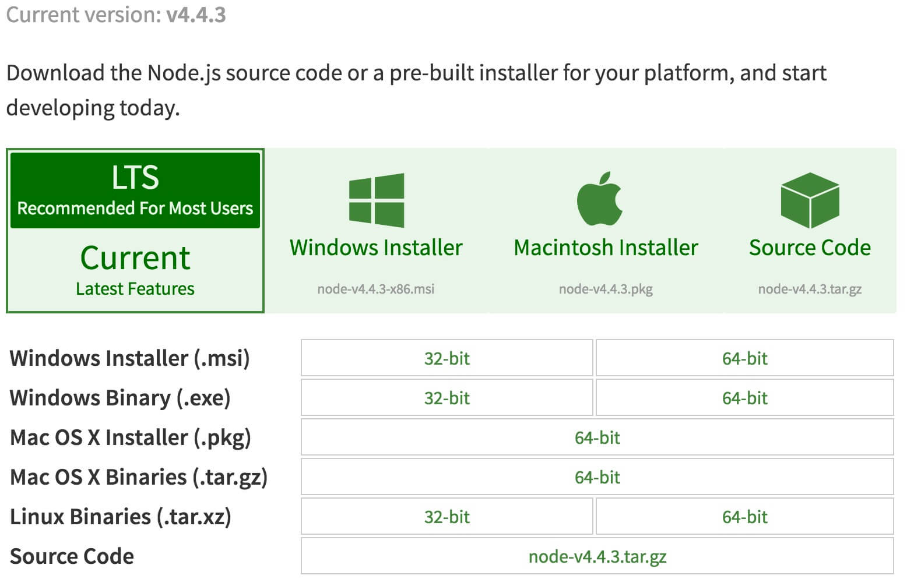

### 安装node.js
一直以来，我们深深喜爱着的方式，也是习惯了的方式是需要哪个js，就在页面`<script src="xx.js"></script>`，然后需要把js引入到文档底部来加速渲染页面。  

所以小伙伴们肯定希望学习react从引入react.js开始，然后自己写个index.js或者demo.js来引入。我们还得引入`<script
src="https://cdn.bootcss.com/babel-standalone/6.22.1/babel.min.js"></script>`，但自己引入的index.js需要这么写`<script type="text/babel" src="index.js">`这么做是希望浏览器能够认识我们接下来要学习的react的写法。他加入的jsx的语法糖，含有es6的招式，所以旧版本浏览器不认识。react没有ajax功能，所以我们想引入jQuery.js，我们还想引入bootstrap.css。    

是不是发现学习react也挺简单的，其实不然。你会发现还是跑不起来，因为他需要服务器支撑，我们再把搭建好的react demo放到tomcat下面，然后就问localhost:8080/reactdemo/index.html 然后就跑起来了。     

虽然跑起来了，以上的我们留恋的学习姿势是错误的，是不符合当下形式的。    

使用node.js，我们就可以使用标准的软件开发流程：
1. 本地开发
2. 静态代码检查
3. 单元测试
4. 合并进入主干
5. 自动构建
6. 自动发布
而且集成webpack等自动化工具之后，我们无需考虑浏览器对js代码的兼容性等问题，而且将react的渲染工作提前了，不需要再运行时解析，大大提高了效率。

###### 介绍
- Node.js
	简单的说 Node.js 就是运行在服务端的 JavaScript。
	Node.js 是一个基于Chrome JavaScript 运行时建立的一个平台。
	Node.js是一个事件驱动I/O服务端JavaScript环境，基于Google的V8引擎，V8引擎执行Javascript的速度非常快，性能非常好。
- NPM
	NPM是随同NodeJS一起安装的包管理工具，能解决NodeJS代码部署上的很多问题

###### 安装
Node.js安装包及源码下载地址为：https://nodejs.org/en/download/。

下载对应的安装包，直接安装即可。
安装完成后，我们就可以使用node.js以及他的包管理工具npm了。

###### npm的使用场景及升级
- NPM常见的使用场景有以下几种：
  允许用户从NPM服务器下载别人编写的第三方包到本地使用。
  允许用户从NPM服务器下载并安装别人编写的命令行程序到本地使用。
  允许用户将自己编写的包或命令行程序上传到NPM服务器供别人使用。
- 通过输入 "npm -v" 来测试是否成功安装。命令如下，出现版本提示表示安装成功:
  ```shell
  $npm -v
  2.3.0
  ```
- 使用npm install npm -g 来升级到最新版的npm

###### 使用npm命令安装模块
- npm 安装 Node.js 模块语法格式如下：
	`$ npm install <Module Name>`
- 以下实例，我们使用 npm 命令安装常用的 Node.js web框架模块 express:
  `$ npm install express`
- 安装好之后，express 包就放在了工程目录下的 node_modules 目录中，因此在代码中只需要通过 require('express') 的方式就好，无需指定第三方包路径。
  `var express = require('express');`

###### 全局安装与本地安装
- 本地安装
  1. 将安装包放在 ./node_modules 下（运行 npm 命令时所在的目录），如果没有 node_modules 目录，会在当前执行 npm 命令的目录下生成 node_modules 目录。
  2. 可以通过 require() 来引入本地安装的包。
- 全局安装
  1. 将安装包放在 /usr/local 下或者你 node 的安装目录。
  2. 可以直接在命令行里使用。
npm 的包安装分为本地安装（local）、全局安装（global）两种，从敲的命令行来看，差别只是有没有-g而已
```shell
npm install react #本地安装
npm install react -g #全局安装
```
###### Package.json
package.json 位于模块的目录下，用于定义包的属性。
通常使用npm init来生成package.json，其中声明了开发者，以及依赖库等相关信息，完成后，其他人可以直接通过npm install来直接生成你所定义的开发环境，而不需要重新配置。
Package.json 属性说明：
  - name - 包名。
  - version - 包的版本号。
  - description - 包的描述。
  - homepage - 包的官网 url 。
  - author - 包的作者姓名。
  - contributors - 包的其他贡献者姓名。
  - dependencies - 依赖包列表。如果依赖包没有安装，npm 会自动将依赖包安装在 node_module 目录下。
  - repository - 包代码存放的地方的类型，可以是 git 或 svn，git 可在 Github 上。
  - main - main 字段是一个模块ID，它是一个指向你程序的主要项目。就是说，如果你包的名字叫 express，然后用户安装它，然后require("express")。
  - keywords - 关键字
###### 升级、卸载模块
- 卸载模块
  我们可以使用以下命令来卸载 Node.js 模块。
  `npm uninstall react`
- 更新模块
  我们可以使用以下命令更新模块：
  `npm update react`
- 搜索模块
  使用以下来搜索模块：
  `npm search react`

### 安装React脚手架工具
安装成功node.js后，我们就可以安装用官方提供的create-react-app，然后用它来安装react
```shell
npm install -g create-react-app
create-react-app hello-world
```
通过官方提供的安装方式，我们安装好之后，会是一个hello world的事例,我们接下来就可以在这个基础上直接进行react的相关开发，而不用去考虑如何搭建开发环境了，这个官方事例使用的是 webpack, Babel and ESLint，可以通过如下命令来启动：
```shell
//开发模式
npm start
//打包发布
npm run build
//模块测试
npm run test
//语法检测
npm run eject
```
### 目录结构说明
- node_modules
> node.js模块库，开发中使用的模块，均在这个文件夹下，比如react

- public
> 公共资源库，此文件夹下存放的是一些公共资源文件，比如index.html，比如图片文件等
> 在react开发中，index.html这个入口文件一般写好后就无需修改了

- src
> 开发目录，我们的所有开发都会在这个目录下进行，一般会按照个人习惯划分目录，详细的目录划分，我们在dva实战中在讲解

- .gitignore
> github忽略文件，比如node_moudles这个文件夹，它本身是通过package.json中配置，通过npm安装生成的，并不需要我们保存和维护，所以保存这个文件夹到github上是不明智的，一般情况下，我们不想上传到github上的文件夹、文件都通过此文件进行配置

- package.json
> node.js声明文件，定义了这个项目所需要的各种模块,以及项目的配置信息(比如名称、版本、许可证等元数据)。

- README.md
> 说明文件，一般放在根目录，用来说明项目的内容以及启动方式等。
