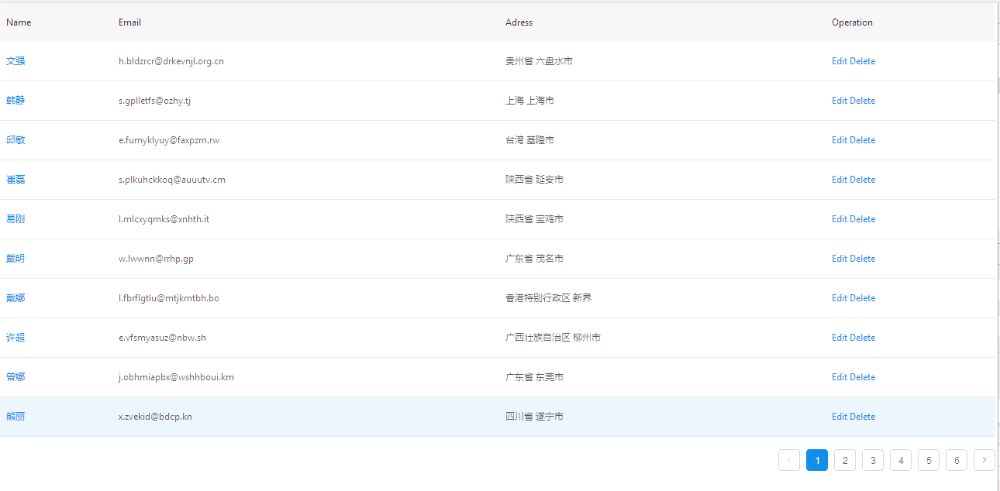

# dva实战
上面的所有内容学习完成后，我们就可以基于dva完成一个项目实战了。
### 搭建工程
- 安装脚手架工具

  首先需要安装dva脚手架工具dva-cli：

  `$ cnpm install -g dva-cli`

  安装完成后，使用`$ dva -v`查看版本，是否安装成功。
  安装完成后，我们就可以使用dva-cli创建工程了

  ```shell
  $ dva new dva-demo
  $ cd dva-demo
  $ cnpm install
  ```

- 配置 antd 和 babel-plugin-import

  antd为阿里出品的组件库，有了它，大部分基础组件，我们就可以直接使用，而非自己开发了。
  babel-plugin-import 用于按需引入 antd 的 JavaScript 和 CSS，这样打包出来的文件不至于太大。

  ```shell
  $ cnpm i antd --save
  $ cnpm i babel-plugin-import --save-dev
  ```

  修改 .roadhogrc，在 "extraBabelPlugins" 里加上：

  `["import", { "libraryName": "antd", "style": "css" }]`

  >这里我们使用的是cnpm，并没有使用npm，因为限制的原因npm在国内速度过于缓慢了，所以推荐使用cnpm或者yarn

- 启动应用

  通过`npm start`即可启动项目，通过dva-cli创建项目后，脚手架工具已经为我们生成了一个demo示例。

- dva目录结构说明

  通过dva-cli生成的目录结构，我们需要了解一下，以便未来开发，分清各个文件文件夹的作用。
  ├── /dist/	# 生产环境。打包输出的部署文件夹，上线部署时使用此文件   
  ├── /mock/           # 数据mock的接口文件   
  ├── /node_modules/	# 第三方类库和工具   
  ├── /public/           # 公共的文件（此文件夹里的文件不会经过打包工具处理，会原样拷贝过去）   
  │ ├── /assets/			
  │ └──index.html			
  ├── /src/            # 项目源码目录   
  │ ├── /assets/	   # 公共的文件（如图片，js等此文件夹里的文件会经过webpack打包处理）   
  │ ├── /components/   # 项目组件   
  │ ├── /routes/       # 路由组件（页面维度）   
  │ ├── /models/      # 数据模型   
  │ ├── /services/     # 数据接口   
  │ ├── /utils/        # 工具函数   
  │ ├── route.js       # 路由配置   
  │ ├── index.js       # 入口文件   
  │ └── index.css     # 公共样式       
  ├── /themes/ 		   # 自定义样式   
  ├── .editorconfig      # 该文件的内容定义该项目的编码规范   
  ├── .eslintrc		    #js、jsx、es6(es2015)等代码的检测   
  ├── .roadhogrc.js		#配置文件 如程序入口、css模块、   
  ├── .roadhogrc.mock.js  #配置mock相关功能 支持require动态分析，支持ES6   
  ├── theme.config.js     #主题配置   
  ├── package.json     # 项目信息   
  └── proxy.config.js  # 数据mock配置 代理   

### mock数据
在前后台共同进行一个项目的时候常会遇到一种情景, 后台定义好接口,前端按照接口进行开发, 当前端开发完成后台接口却还没有开发完成, 这个时候要进行接口测试, 只能等后台开发完成才能测试, 在这中间浪费了很多时间,  现在有个利器可以解决这个问题, 即使不用后台,只要提前制定好接口的报文,那么前端就可以自己模拟接口来进行接口测试。所以我们优先搭建一个mock数据的环境。

- 安装mockjs

  `$ cnpm install mockjs --save`

  安装完成后，即可使用mockjs来生成数据了，dva本身支持mock数据了，直接在.roadhogrc.mock.js中配置即可使用。

- mockjs语法规则
  - 属性名 和 生成规则 之间用竖线 | 分隔。
  - 生成规则 是可选的。
  - 生成规则 有 7 种格式：
    - 'name|min-max': value
    - 'name|count': value
    - 'name|min-max.dmin-dmax': value
    - 'name|min-max.dcount': value
    - 'name|count.dmin-dmax': value
    - 'name|count.dcount': value
    - 'name|+step': value
  - 生成规则 的 含义 需要依赖 属性值的类型 才能确定。
  - 属性值 中可以含有 @占位符。
  - 属性值 还指定了最终值的初始值和类型。
  具体的语法以及示例，可以在[mockjs](http://mockjs.com/)官网去查看。

- 生成mock数据
  为了方便维护以及条理的清晰，我们将具体的mock规则写到mock/文件夹下，然后.roadhogrc.mock.js中，只维护mock接口。
  首先在mock下写一个用户列表的接口：
  ```JavaScript
  import Mock from 'mockjs';

  export default {
    userList:Mock.mock({
        code:"0000",
        'data|10': [{
            'id|+1': '@guid',
            'name':'@cname',
            'email':'@email',
            'adress':'@city(true)',
            'zip':'@zip'
        }],
        total:58
    })
  };
  ```
  具体语法规则可以查看mockjs的[示例](http://mockjs.com/examples.html)
  完成userList的数据生成规则后，我们就可以在.roadhogrc.mock.js中定义该接口了
  ```JavaScript
  import news from './mock/news';

  export default {
    'GET /api/news/getList': news.getList
  };
  ```
  接下来，在 http://127.0.0.1:8000/api/user/getList ,即可看到数据了

### 完成User组件
- 生成user路由

  使用`dva g route users`,生成users路由。
  打开浏览器：http://127.0.0.1:8000/#/users，即可看到users。
  使用脚手架工具创建的路由，工具会自动将src/router.js补全，免去了我们自己创建的繁琐。

- 增加user接口访问
  ```JavaScript
  import request from '../utils/request';

  export function fetch({ page = 1 }) {
    return request(`/api/user/getList?page=${page}`);
  }
  ```

- 构造 users model 和 service

  使用`dva g model users`生成model:
  ```JavaScript
  export default {
    namespace: 'users',
    state: {},
    reducers: {},
    effects: {},
    subscriptions: {},
  };
  ```
  如上所示，dva集成并封装了redux，将reducers、effects、subscriptions集成到了同一个地方，方便开发维护。
  接下来完善model：
  ```JavaScript
  import * as usersService from '../services/users';

  export default {
    namespace: 'users',
    state: {
      list: [],
      total: null,
      page: null,
    },
    reducers: {
      save(state, { payload: { data: list, total, page } }) {
         return { ...state, list, total, page };
      },
    },
    effects: {
      *fetch({ payload: { page = 1 } }, { call, put }) {
        const { data:{code,data,total} } = yield call(usersService.fetch, { page });
        yield put({ type: 'save', payload: { data, total, page: parseInt(page, 10) } });
      },
    },
    subscriptions: {
      setup({ dispatch, history }) {
        return history.listen(({ pathname, query }) => {
          if (pathname === '/users') {
            dispatch({ type: 'fetch', payload: query });
          }
        });
      },
    }
  };
  ```
  添加用户界面，关联model
  使用`dva g component Users/Users`添加Users组件
  修改Users组件：
  ```JavaScript
  import React from 'react';
  import { connect } from 'dva';
  import { Table, Pagination, Popconfirm } from 'antd';
  import styles from './Users.css';

  const PAGE_SIZE = 10;
  function Users({ list: dataSource, total, page: current }) {
    function deleteHandler(id) {
      console.warn(`TODO: ${id}`);
    }
    const columns = [
      {
        title: 'Name',
        dataIndex: 'name',
        key: 'name',
        render: text => <a href="">{text}</a>,
      },
      {
        title: 'Email',
        dataIndex: 'email',
        key: 'email',
      },
      {
        title: 'Adress',
        dataIndex: 'adress',
        key: 'adress',
      },
      {
        title: 'Operation',
        key: 'operation',
        render: (text, { id }) => (
          <span className={styles.operation}>
            <a href="">Edit </a>
            <Popconfirm title="Confirm to delete?" onConfirm={deleteHandler.bind(null, id)}>
              <a href="">Delete</a>
            </Popconfirm>
          </span>
        ),
      },
    ];
    return (
      <div className={styles.normal}>
        <div>
          <Table
            columns={columns}
            dataSource={dataSource}
            rowKey={record => record.id}
            pagination={false}
          />
          <Pagination
            className="ant-table-pagination"
            total={total}
            current={current}
            pageSize={PAGE_SIZE}
          />
        </div>
      </div>
    );
  }
  function mapStateToProps(state) {
    const { list, total, page } = state.users;
    return {
      list,
      total,
      page,
    };
  }
  export default connect(mapStateToProps)(Users);
  ```
  ```css
  .normal {
  }
  .operation a{
    margin-left: 10px;
  }
  ```
  我们使用了ant-desin 中的 Table, Pagination, Popconfirm组件，这些组件，在ant desin官网能找到详细的API以及demo，基本上毫无学习成本。
  上面我们通过mapStateToProps取到了redux中的state值。
  接下来在路由组件中把我们的Users组件写进去，整个流程就跑通了。
  ```JavaScript
  import React from 'react';
  import { connect } from 'dva';
  import UsersComponent  from '../components/Users/Users';
  import styles from './Users.css';

  function Users() {
    return (
      <UsersComponent ></UsersComponent>
    );
  }
  export default connect()(Users);
  ```
  运行`npm start`看看成果吧：
  

### 添加layout

  现在是用户列表页面，我们还需要一个首页，ant design 给我们提供了layout布局，我们可以直接引入使用。
  ```JavaScript
  import React from 'react';
  import styles from './MainLayout.css';
  import Header from './Header';

  function MainLayout({ children, location }) {
    return (
      <div className={styles.normal}>
        <Header location={location} />
        <div className={styles.content}>
          <div className={styles.main}>
            {children}
          </div>
        </div>
      </div>
    );
  }

  export default MainLayout;
  ```
  ```css
  .normal {
    display: flex;
    flex-direction: column;
    height: 100%;
  }

  .content {
    flex: 1;
    display: flex;
  }

  .main {
    padding: 0 8px;
    flex: 1 0 auto;
  }
  ```
  我们将导航部分提炼出来，单独写一个组件，来嵌套到Layout中：
  ```JavaScript
  import React from 'react';
  import { Menu, Icon } from 'antd';
  import { Link } from 'dva/router';

  function Header({ location }) {
    return (
      <Menu
        selectedKeys={[location.pathname]}
        mode="horizontal"
        theme="dark"
      >
        <Menu.Item key="/">
          <Link to="/"><Icon type="home" />Home</Link>
        </Menu.Item>
        <Menu.Item key="/users">
          <Link to="/users"><Icon type="bars" />Users</Link>
        </Menu.Item>
        <Menu.Item key="/404">
          <Link to="/page-you-dont-know"><Icon type="frown-circle" />404</Link>
        </Menu.Item>
        <Menu.Item key="/antd">
          <a href="https://github.com/dvajs/dva" target="_blank">dva</a>
        </Menu.Item>
      </Menu>
    );
  }

  export default Header;
  ```
  完成Layout组件之后，我们就可以把IndexPage和Users添加到MainLayout中了：
  ```JavaScript
  import React from 'react';
  import { connect } from 'dva';
  import styles from './Users.css';
  import UsersComponent from '../components/Users/Users';
  import MainLayout from '../components/MainLayout/MainLayout';

  function Users({ location }) {
    return (
      <MainLayout location={location}>
        <div className={styles.normal}>
          <UsersComponent />
        </div>
      </MainLayout>
    );
  }

  export default connect()(Users);
  ```
  ```JavaScript
  import React from 'react';
  import { connect } from 'dva';
  import styles from './IndexPage.css';
  import MainLayout from '../components/MainLayout/MainLayout';

  function IndexPage({ location }) {
    return (
      <MainLayout location={location}>
        <div className={styles.normal}>
          <h1 className={styles.title}>Yay! Welcome to dva!</h1>
          <div className={styles.welcome} />
          <ul className={styles.list}>
            <li>To get started, edit <code>src/index.js</code> and save to reload.</li>
            <li><a href="https://github.com/dvajs/dva-docs/blob/master/v1/en-us/getting-started.md">Getting Started</a></li>
          </ul>
        </div>
      </MainLayout>
    );
  }

  IndexPage.propTypes = {
  };

  export default connect()(IndexPage);
  ```
