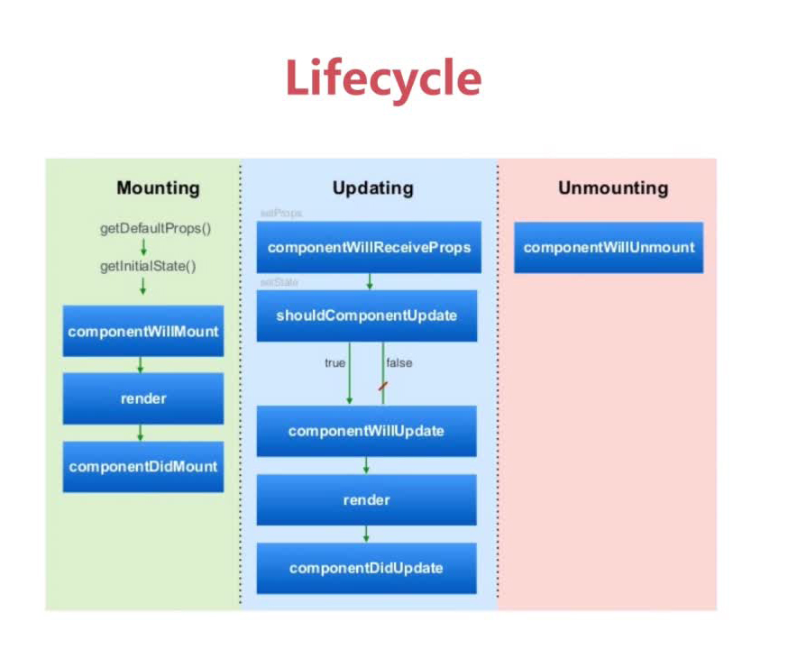

# 组件的生命周期
组件的生命周期可分成三个状态：
- Mounting：已插入真实 DOM
- Updating：正在被重新渲染
- Unmounting：已移出真实 DOM

如下图所示：


React 为每个状态都提供了两种处理函数，will 函数在进入状态之前调用，did 函数在进入状态之后调用，三种状态共计五种处理函数。
```JavaScript
//在渲染前调用,在客户端也在服务端。
componentWillMount()
//在第一次渲染后调用，只在客户端。之后组件已经生成了对应的DOM结构，可以通过this.getDOMNode()来进行访问。 如果你想和其他JavaScript框架一起使用，可以在这个方法中调用setTimeout, setInterval或者发送AJAX请求等操作(防止异部操作阻塞UI)。
componentDidMount()
//在组件接收到新的props或者state但还没有render时被调用。在初始化时不会被调用。
componentWillUpdate(object nextProps, object nextState)
//在组件完成更新后立即调用。在初始化时不会被调用。
componentDidUpdate(object prevProps, object prevState)
//在组件从 DOM 中移除的时候立刻被调用。
componentWillUnmount()
```
此外，React 还提供两种特殊状态的处理函数。
```JavaScript
//在组件接收到一个新的prop时被调用。这个方法在初始化render时不会被调用。
componentWillReceiveProps(object nextProps)：已加载组件收到新的参数时调用
//返回一个布尔值。在组件接收到新的props或者state时被调用。在初始化时或者使用forceUpdate时不被调用。 可以在你确认不需要更新组件时使用。
shouldComponentUpdate(object nextProps, object nextState)：组件判断是否重新渲染时调用
```
### Mounted阶段
看下面的示例代码：
```JavaScript
import React from 'react';

class Mounted extends React.Component{
  constructor(props) {
      super(props);
      this.state = {date: new Date().getTime()};
  }
  componentDidMount(){
    console.log('componentDidMount()');
  }
  componentWillMount(){
    console.log('componentWillMount()');
  }
  render(){
    console.log('开始执行render()');
    return (
      <div>Hello World，props:{this.props.name},state:{this.state.date}</div>
    );
  }
}

export default Mounted;
```
打开控制台，就能够看到Mounted阶段的执行顺序，关于state和props的区别，我们会单独开一个章节来学习，这里只需要简单的区分为：props为父组件传递过来的参数，一般不能再当前组件上修改，state属于当前组件自己的属性，可以修改。

### update阶段
看下面的代码：
首先写一个子组件，用来接收props
```JavaScript
import React from 'react';

export default class TextComponent extends React.Component {
    componentWillMount() {
        console.log('Component WILL MOUNT!')
    }
    componentDidMount() {
        console.log('Component DID MOUNT!')
    }
    componentWillReceiveProps(newProps) {
        console.log('Component WILL RECEIVE PROPS!')
    }
    shouldComponentUpdate(newProps, newState) {
        if (newProps.myNumber <= 10) {
            return true;
        } else {
            return false;
        }
    }
    componentWillUpdate(nextProps, nextState) {
        console.log('Component WILL UPDATE!');
    }
    componentDidUpdate(prevProps, prevState) {
        console.log('Component DID UPDATE!')
    }
    componentWillUnmount() {
        console.log('Component WILL UNMOUNT!')
    }
    render() {
        return (
            <div>
                <h3>{this.props.myNumber}</h3>
            </div>
        );
    }
}
```
这里我们将定义class和export写在一起了，是因为我们只有这么一个class需要export，如果存在多个的话，不建议这么写，会造成逻辑不清晰
接下来，来编写Update测试：
```JavaScript
import React from 'react';
import TextComponent from './TextComponent';

class Update extends React.Component {
    constructor(props) {
        super(props)
        this.state = {
            data: 0
        }
    }
    setNewNumber() {
        this.setState({
            data: this.state.data + 1
        })
    }
    render() {
        return (
            <div>
                <button onClick={this.setNewNumber.bind(this)}>点击计数</button>
                <TextComponent myNumber={this.state.data}/>
            </div>
        );
    }
}

export default Update;
```
初始化 state ， setNewnumber 用于更新 state。
state的更新，会触发子组件TextComponent的重新渲染，由此可以在TextComponent中查看生命周期。
同时我们对shouldComponentUpdate做了处理，来理解React的性能优化，我们假定一个条件（num>=10）以后，为了性能，就不在进行render渲染了。

### UnMount阶段
为了便于测试，我们继续使用TextComponent，之前其实已经在这个组件中加入了代码，只不过该组件并未执行Unmount，所以没有执行而已：
```JavaScript
componentWillUnmount() {
    console.log('Component WILL UNMOUNT!')
}
```
接下来我们来看Unmount的例子
```JavaScript
import React from 'react';
import TextComponent from './TextComponent';

class UnMounted extends React.Component{
  constructor(props){
    super(props)
    this.state = {isUnMounted: true};
  }
  hanldeChange(){
    this.setState({isUnMounted:!this.state.isUnMounted})
  }
  render(){
    console.log('开始执行render()');
    return (
      <div>
        {this.state.isUnMounted?
          <div>去掉了TextComponent组件</div>:<TextComponent myNumber="这是TextComponent组件" />
        }
        <div><button onClick={this.hanldeChange.bind(this)}>点击切换</button></div>
      </div>
    );
  }
}

export default UnMounted;
```
通过控制isUnMounted就可以控制TextComponent的加载与移除，在移除TextComponent之前，我们就会看到`Component WILL UNMOUNT!`打印在控制台了

***
[查看示例代码](https://github.com/yxl2628/reactjs/blob/master/code/lifecycle
