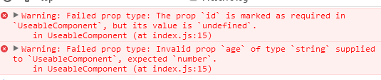

# 可复用组件
我们提炼组件的目的就是为了可复用，那么一个可复用的组件应该是什么样的呢
### props验证
Props 验证使用 propTypes，它可以保证我们的应用组件被正确使用，React.PropTypes 提供很多验证器 (validator) 来验证传入数据是否有效。当向 props 传入无效数据时，JavaScript 控制台会抛出警告。它可以避免随着你的应用的程序越来越复杂从而出现很多的bug和问题。并且，它还可以是你的程序变得更易读。
这么做的好处是显而易见的，我们不需要在组件内部去判断值是否存在，是否合法，只需要按照它正确的方式来使用就够了，不正确的方式，都被拦截在最外层了。
```javascript
import React from 'react';

function UseableComponent({id,name,age,email}){
    return (
      <div>
        <div>id:{id}</div>
        <div>name:{name}</div>
        <div>age:{age}</div>
        <div>email:{email}</div>
      </div>
    );
}

UseableComponent.propTypes = {
  id: React.PropTypes.number.isRequired,
  name: React.PropTypes.string,
  age:React.PropTypes.number,
  email:React.PropTypes.string
};

export default UseableComponent;
```
如果我们按照规则调用，没有问题，可以直接显示：
```javascript
import React from 'react';
import ReactDOM from 'react-dom';
import UseableComponent from './component/UseableComponent';
import './index.css';

ReactDOM.render(
  <UseableComponent name="yang.xiaolong" id="1" age="30" email="yxl2628@qq.com" />,
  document.getElementById('root')
);
```
但是如果我们写错了，那控制台就会给出很明显的错误：
```javascript
import React from 'react';
import ReactDOM from 'react-dom';
import UseableComponent from './component/UseableComponent';
import './index.css';

ReactDOM.render(
  <UseableComponent name="yang.xiaolong" age="sss" email="yxl2628@qq.com" />,
  document.getElementById('root')
);
```


### props默认值
通常情况下，组件会有个默认值，比方说简单的按钮组件，日历组件等，他们都需要在调用的时候提供默认的样式，这种情况下，为了更好的复用组件，组建内部就需要提供默认值了
```javascript
import React from 'react';

function UseableComponent({id,name,age,email}){
    return (
      <div>
        <div>id:{id}</div>
        <div>name:{name}</div>
        <div>age:{age}</div>
        <div>email:{email}</div>
      </div>
    );
}

UseableComponent.defaultProps = {
  id:0,
  name:'defaultName',
  age:10,
  email: 'defult@email.com'
}

export default UseableComponent;

```
通过UseableComponent.defaultProps方式就可以给组件赋予默认值了
```javascript
import React from 'react';
import ReactDOM from 'react-dom';
import UseableComponent from './component/UseableComponent';
import './index.css';

ReactDOM.render(
  <UseableComponent name="yang.xiaolong"/>,
  document.getElementById('root')
);

```
有了默认值之后，调用组件的时候，如果不传递props， 那么会使用默认值，如果传递了值，就会使用传递的值，如上述示例，name传值了，所以是yang.xiaolong，email没有传值，则值为defult@email.com。

***
[查看示例代码](https://github.com/yxl2628/reactjs/blob/master/code/reusable_components)
